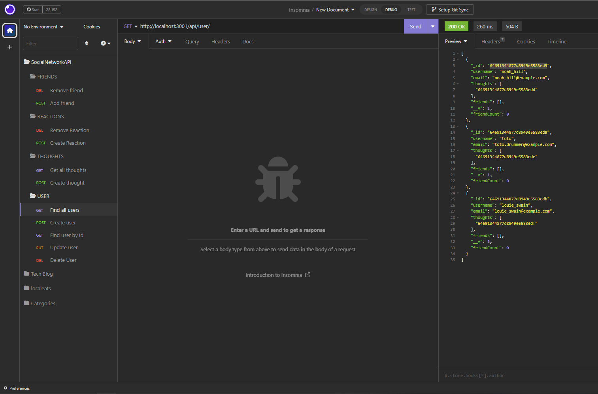

# Social-Network-API []

## Description

This is an API for a social network web application where users can share their, thoughts, react to friends thoughts, and create a friend list.

## URL Walkthrough Video

https://drive.google.com/file/d/1TOu9WI3RhL7F-LmYWvESpAKZslGM00Ko/view?usp=sharing

## Table of Contents

- [Installation](#installation)
- [Technologies](#technologies)
- [Usage](#usage)
- [License](#license)
- [Questions](#questions)

## Installation

git clone -> npm i -> npm run seed -> npm start -> test it in insomnia

## Technologies

- Javascript: to add functionality.
- Node.js: to run javaScript in the Backend (Environment).
- MongoDB/Mongoose: NoSQLto create Schemas/models for database.

## Usage

You can use this API for editing your social media network by executing CRUD operations for users, thoughts, and reactions.

## License

[]

## Questions

Contact: <andrea.anza3@gmail.com>
